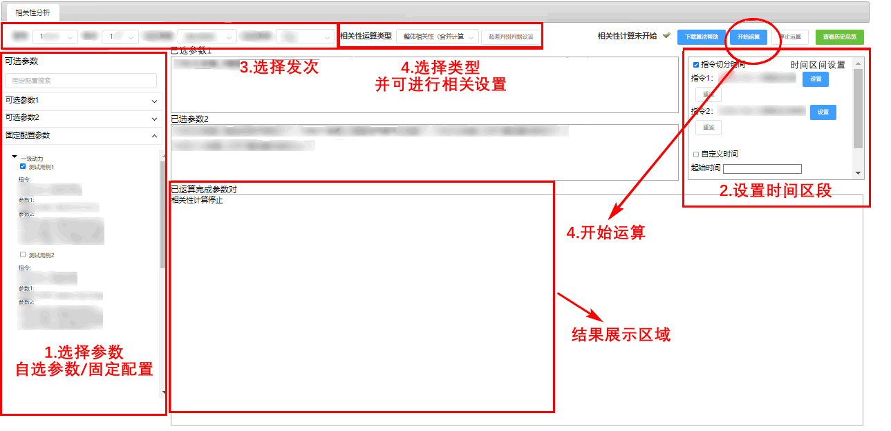

# Correlation-Analysis
This repository is used to analyze different types of correlations between parameters.

# Functions
(1) Overall correlation calculation.

(2) Calculation of deviation from historical data and criterion discrimination.

(3) Time slices correlation calculation and Matrix diagonal highlight information extraction.

(4) Extract the slope consistency interval and record the degree.

(5) Time difference correlation calculation and causal information extraction.

# Instructions

Change the calculation type and parameters information in the `argument-corr.json`,and then:

```python
cd ./pyscript

python run.py
```


# Data
The data should be loaded from Hbase type Database, and details can be changed in `/web/setting/setting.txt`. HBaseAddr, HBasePort indicates the address and port of HBase. 

# Results
The calculation results will be saved into `/history`/ automatically in a canonical readable manner. Under every type, it will include `result.json` and related images in `/img/`.

# Web

Embedding the above code into the front-end web framework can start a web service. This is a screenshot of the web service we have implemented locally. The parameters have been blurred.

